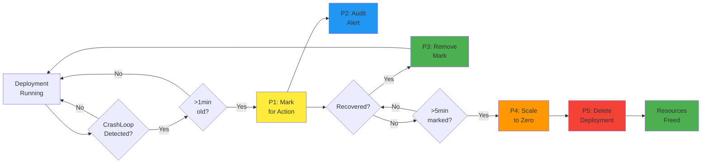

# Automated Deployment Cleanup with Kyverno - Resource Optimizer

## 🔄 System Workflow Diagram



## Overview

This folder contains a comprehensive Kyverno policy set designed to automatically detect, monitor, and clean up problematic deployments in Kubernetes clusters. The system focuses on identifying deployments with persistent CrashLoopBackOff issues and progressively scaling them down to optimize cluster resources.

## 🎯 Objectives

- **Resource Optimization**: Automatically identify and remove resource-consuming failed deployments
- **Proactive Monitoring**: Early detection of problematic deployments before they impact cluster performance
- **Progressive Cleanup**: Multi-stage approach with recovery opportunities and audit trails
- **Cost Reduction**: Free up computational resources from persistently failing workloads

## 🔄 Workflow Overview

The cleanup process follows a 5-stage progressive approach:

1. **Detection & Marking** → Mark deployments with persistent issues
2. **Audit & Notification** → Alert teams about pending actions
3. **Recovery Handling** → Remove marks if issues resolve
4. **Scale Down** → Reduce resource consumption
5. **Final Cleanup** → Remove unsuccessful deployments

## 📋 Policy Details

### 1. CrashLoopBack Detection & Mutation
**File**: `1-clusterpolicy-crashloopback-mutation.yaml`

**Purpose**: Identifies and marks problematic deployments
- Monitors deployments where all pods are in CrashLoopBackOff state
- Checks if the last update timestamp of the latest replicaSet of a deployment is > 1 minute old
- Adds identification annotations for tracking. Here `{{ time_now_utc() }}` refers to the time in UTC timezone.

**Annotations Added**:
```yaml
cleanup.resource: "marked-for-action"
timestamp: "{{ time_now_utc() }}"
```

### 2. Audit & Validation Policy
**File**: `2-clusterpolicy-crashloopback-validation.yaml`

**Purpose**: Provides visibility and alerts for marked deployments
- Audit-mode policy that flags deployments marked for action
- Generates policy reports for monitoring dashboards (Nirmata Control Hub (NCH) or Grafana)
- Notifies users about pending scale-down actions

### 3. Recovery & Label Removal
**File**: `3-clusterpolicy-crashloopback-remove-label-mutation.yaml`

**Purpose**: Handles deployment recovery scenarios
- Monitors deployments with running pods > 0
- Automatically removes cleanup annotations when issues resolve
- Prevents unnecessary actions on recovered deployments

**Annotations Removed**:
```yaml
cleanup.resource: "marked-for-action"
timestamp: "<previous_timestamp>"
```

### 4. Scale Down Mutation
**File**: `4-clusterpolicy-scaledown-mutation.yaml`

**Purpose**: Scales down persistently problematic deployments
- Targets deployments marked for action for > 5 minutes
- Scales replicas to 0 to stop resource consumption
- Adds scale-down timestamp for final cleanup tracking

**Actions**:
- Set `spec.replicas: 0`
- Add `scaledowntimestamp: "{{ time_now_utc() }}"`

### 5. Deployment Deletion
**File**: `5-clusterpolicy-delete-deployment.yaml`

**Purpose**: Final cleanup of scaled-down deployments
- Identifies deployments with scale-down timestamps
- Completely removes deployments from the cluster
- Frees up all associated resources

## 🚀 Benefits

### Resource Optimization
- **Immediate Impact**: Stop resource consumption from failing pods
- **Cost Savings**: Reduce compute costs from unnecessary replicas
- **Cluster Health**: Prevent resource exhaustion from accumulating failed deployments

### Operational Excellence
- **Automated Recovery**: Self-healing system that recovers when issues resolve
- **Audit Trail**: Complete visibility into cleanup actions
- **Progressive Approach**: Multiple checkpoints prevent accidental deletions

### Developer Experience
- **Early Warning**: Audit policies provide advance notice
- **Recovery Window**: 5-minute grace period allows for quick fixes
- **Transparency**: Clear annotation system shows system state

## 🛠️ Installation

1. **Prerequisites**:
   - Kyverno v1.10+ installed in your cluster
   - Appropriate RBAC permissions for Kyverno to modify deployments
   - Kyverno's ConfigMap modified to remove the line `excludeGroups: system:nodes`. This is needed from v1.10 onwards
   - Kyverno's ConfigMap modified to generate events for all policy types (Update `generateSuccessEvents: "true"`)

2. **Deploy Policies**:
   ```bash
   kubectl apply -f 1-clusterpolicy-crashloopback-mutation.yaml
   kubectl apply -f 2-clusterpolicy-crashloopback-validation.yaml
   kubectl apply -f 3-clusterpolicy-crashloopback-remove-label-mutation.yaml
   kubectl apply -f 4-clusterpolicy-scaledown-mutation.yaml
   kubectl apply -f 5-clusterpolicy-delete-deployment.yaml
   ```

3. **Verify Installation**:
   ```bash
   kubectl get clusterpolicy
   kubectl get policyreport -A
   ```

## 🔍 Monitoring

### Policy Reports
Monitor cleanup activities through Kyverno policy reports:
```bash
kubectl get policyreport -A | grep crashloopback
```

### Deployment Annotations
Check deployment status via annotations:
```bash
kubectl get deployments -A -o jsonpath='{range .items[*]}{.metadata.name}{"\t"}{.metadata.annotations.cleanup\.resource}{"\n"}{end}'
```

### Cluster Events
Monitor Kubernetes events for policy actions:
```bash
kubectl get events --field-selector reason=PolicyViolation
```

## ⚠️ Important Considerations

### Safety Measures
- **Grace Period**: 5-minute window allows for issue resolution
- **Recovery Logic**: Automatic removal of marks when deployments recover
- **Audit Trail**: All actions are logged and visible

### Customization Options
- Adjust timing thresholds in policy conditions
- Modify annotation keys/values for your organization
- Add namespace exclusions for critical systems
- Configure notification integrations

### Best Practices
- Test policies in development environments first
- Monitor policy reports regularly
- Set up alerting on policy violations
- Document deployment recovery procedures

## 📚 Additional Resources

- [Kyverno Documentation](https://kyverno.io/docs/)
- [Kyverno Policy Library](https://kyverno.io/policies/)
- [Kubernetes Resource Management](https://kubernetes.io/docs/concepts/configuration/manage-resources-containers/)

---

**Note**: This system is designed for production environments where automated cleanup is desired. Ensure proper testing and stakeholder approval before implementing in critical systems. 
