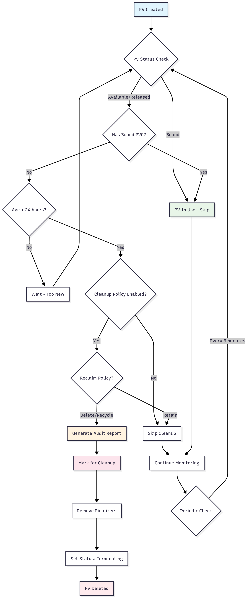

# Kyverno Persistent Volume Cleanup Policy

This repository contains Kyverno policies for automatically cleaning up unused Persistent Volumes (PVs) in Kubernetes clusters, along with audit and reporting capabilities.

## Overview

The PV cleanup policy helps maintain cluster hygiene by:
- Automatically identifying unused PersistentVolumes
- Cleaning up PVs that are not bound to any PersistentVolumeClaim
- Generating audit reports for monitoring
- Providing comprehensive testing with Chainsaw

## Files Structure
```bash
├── README.md
├── policies/
│   ├── pv-cleanup-policy.yaml
│   ├── pv-audit-policy.yaml
│   └── pv-generate-policy.yaml
├── tests/
│   └── chainsaw/
│       ├── pv-cleanup-test.yaml
│       └── test-resources/
│           ├── unused-pv.yaml
│           ├── used-pv.yaml
│           └── test-pod.yaml
└── docs/
    └── pv-workflow-diagram.md
```

## Features

- **Automated Cleanup**: Removes PVs not bound to any PVC after 24 hours
- **Safety Checks**: Multiple preconditions to prevent accidental deletion
- **Audit Reporting**: Generates detailed reports of unused storage
- **Configurable**: Cleanup can be disabled per PV using labels
- **Comprehensive Testing**: Full Chainsaw test suite included

## Architecture



The policy operates through three main components:

1. **Cleanup Policy**: Core logic for identifying and removing unused PVs
2. **Audit Policy**: Monitoring and reporting on unused storage resources
3. **Generate Policy**: Creates ConfigMaps with cleanup recommendations

## Prerequisites

- Kubernetes cluster (v1.20+)
- Kyverno v1.10+ installed
- Chainsaw CLI for testing (optional)

## Installation

1. **Install Kyverno** (if not already installed):
```bash
kubectl create -f https://github.com/kyverno/kyverno/releases/latest/download/install.yaml
```

2. Apply the PV cleanup policies:
```yaml
kubectl apply -f policies/pv-cleanup-policy.yaml
kubectl apply -f policies/pv-audit-policy.yaml
kubectl apply -f policies/pv-generate-policy.yaml
```

3. Verify installation:
```yaml
kubectl get cpol -l app.kubernetes.io/part-of=kyverno-pv-cleanup
```

## Configuration
Cleanup Policy Settings
The cleanup policy can be configured through:

- Age Threshold: PVs must be older than 24 hours (configurable in policy)
- Reclaim Policy: Only processes PVs with Delete or Recycle reclaim policies
- Cleanup Label: Use kyverno.io/cleanup-policy: "disabled" to exclude specific PVs

## Example: Disable cleanup for specific PV

```yaml
apiVersion: v1
kind: PersistentVolume
metadata:
  name: important-pv
  labels:
    kyverno.io/cleanup-policy: "disabled"
spec:
  # ... rest of PV spec
```

## Safety Features

1. Multiple Preconditions: Checks PV status, age, and binding status
2. Reclaim Policy Respect: Only processes PVs with appropriate reclaim policies
3. Opt-out Mechanism: PVs can be excluded using labels
4. Audit Mode: Policies can run in audit mode for initial testing

## Monitoring
### Viewing Audit Reports

```yaml
# List all PV cleanup reports
kubectl get configmaps -n kyverno -l kyverno.io/report-type=pv-cleanup

# View specific report
kubectl get configmap -n kyverno <report-name> -o yaml
```

### Monitoring Policy Events

```yaml
# View policy violation events
kubectl get events --field-selector reason=PolicyViolation

# Monitor cleanup activities
kubectl logs -n kyverno deployment/kyverno-background-controller
```

### Testing
#### Run the comprehensive Chainsaw test suite:
```yaml
# Install Chainsaw CLI
go install github.com/kyverno/chainsaw@latest

# Run tests
chainsaw test tests/chainsaw/
```

### Manual Testing

1. Create test PVs:

```yaml
kubectl apply -f tests/chainsaw/test-resources/
```

2. Wait for policy evaluation (may take a few minutes)
3. Check results:

```yaml 
kubectl get pv
kubectl get events
kubectl get configmaps -n kyverno
```
