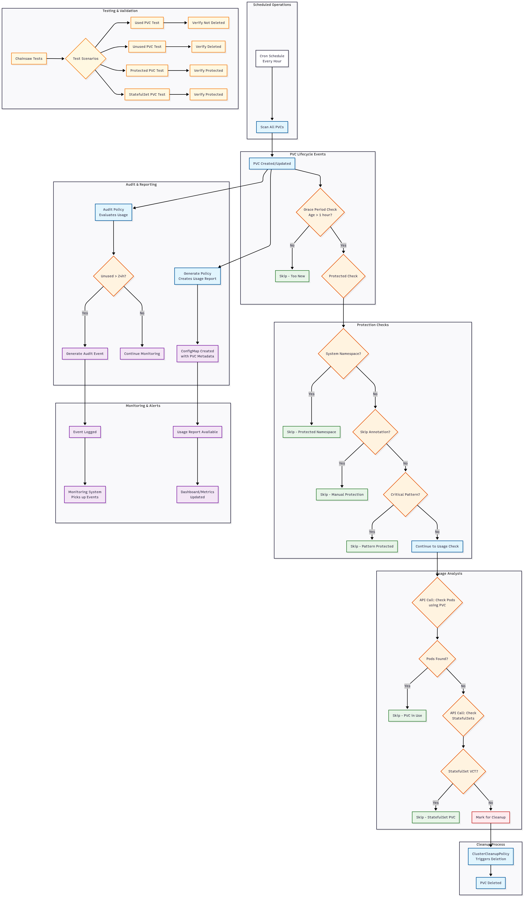

# Kyverno PVC Cleanup Policy Suite

A comprehensive solution for automatically cleaning up unused PersistentVolumeClaims (PVCs) in Kubernetes using Kyverno policies, with built-in safety mechanisms, audit capabilities, and comprehensive testing.

## 🎯 Overview

This policy suite provides:
- **Automated cleanup** of unused PVCs with configurable grace periods
- **Safety mechanisms** to protect critical workloads and system resources
- **Audit capabilities** to track PVC usage patterns before cleanup
- **Reporting features** for monitoring and capacity planning
- **Comprehensive testing** with Chainsaw test framework



## 🚀 Quick Start

### 1. Clone the repository

```bash
git clone <your-repo-url>
cd kyverno-pvc-cleanup
```

### 2. Review and customize policies

Before applying, review the configuration in each file:

- **Grace periods**: Default is 1 hour for new PVCs
- **Excluded namespaces**: Modify system namespace exclusions as needed
- **Protected patterns**: Adjust PVC name patterns to match your environment
- **Schedule**: Cleanup runs hourly by default

### 3. Deploy the policies

Apply the policies in order:

```bash
# 1. Deploy the main cleanup policy
kubectl apply -f cluster-cleanup-policy-unused-pvcs.yaml

# 2. Deploy audit policy
kubectl apply -f cluster-policy-audit-pvc-usage.yaml

# 3. Deploy reporting policy
kubectl apply -f cluster-policy-generate-pvc-usage-report.yaml

# 4. Deploy protection exceptions
kubectl apply -f policy-exception-critical-pvcs.yaml
```

### 4. Verify deployment

```bash
# Check policy status
kubectl get clusterpolicy,clustercleanuppolicy

# Check policy readiness
kubectl get clusterpolicy -o wide

# View policy details
kubectl describe clustercleanuppolicy cleanup-unused-pvcs
```

## 🔧 Configuration

### Customizing Grace Periods

Edit the cleanup policy to adjust timing:

```yaml
# In cluster-cleanup-policy-unused-pvcs.yaml
conditions:
  - key: "{{ time_since('', request.object.metadata.creationTimestamp, '') }}"
    operator: GreaterThan
    value: "24h"  # Change from 1h to 24h for longer grace period
```

### Adding Protected Namespaces

Extend the exclusion list:

```yaml
exclude:
  any:
  - resources:
      namespaces:
      - kube-system
      - your-critical-namespace
      - another-protected-namespace
```

### Protecting Specific PVCs

Use annotations to protect individual PVCs:

```yaml
apiVersion: v1
kind: PersistentVolumeClaim
metadata:
  name: important-pvc
  annotations:
    kyverno.io/skip-cleanup: "true"  # This PVC will never be cleaned up
spec:
  # ... rest of PVC spec
```

### Adjusting Cleanup Schedule

Modify the schedule in the ClusterCleanupPolicy:

```yaml
spec:
  schedule: "0 */6 * * *"  # Run every 6 hours instead of hourly
```

## 📊 Monitoring and Reporting

### Viewing Audit Events

Check for audit events generated by unused PVCs:

```bash
# View Kyverno events
kubectl get events -n kyverno --field-selector reason=PolicyViolation

# Filter for PVC-related events
kubectl get events --all-namespaces | grep "unused.*PVC"

# View detailed audit logs
kubectl logs -n kyverno deployment/kyverno-admission-controller | grep "audit-pvc-usage"
```

### Accessing Usage Reports

The generate policy creates ConfigMaps with detailed usage information:

```bash
# List all PVC usage reports
kubectl get configmaps -n kyverno | grep pvc-usage-report

# View specific report
kubectl get configmap pvc-usage-report-default -n kyverno -o yaml

# Extract JSON report data
kubectl get configmap pvc-usage-report-default -n kyverno -o jsonpath='{.data.pvc-report\.json}' | jq .
```

### Dashboard Integration

To integrate with monitoring systems:

```bash
# Export metrics for Prometheus (example script)
kubectl get configmaps -n kyverno -l app=pvc-usage-report -o json | \
jq -r '.items[].data."pvc-report.json"' | \
jq -s 'map(fromjson) | group_by(.namespace) | map({namespace: .[0].namespace, total_pvcs: length, unused_pvcs: map(select(.pods_using == 0)) | length})'
```

## 🧪 Testing

### Running Chainsaw Tests

Execute the test suites to validate policy functionality:

```bash
# Run main test suite
chainsaw test chainsaw-test-pvc-cleanup-policy.yaml

# Run edge case tests
chainsaw test chainsaw-test-pvc-edge-cases.yaml

# Run all tests
chainsaw test chainsaw-test-*.yaml

# Run tests with verbose output
chainsaw test --test-dir . -v 6
```

### Manual Testing

Create test resources to verify policy behavior:

```bash
# Create test namespace
kubectl create namespace pvc-test

# Create unused PVC
kubectl apply -f - <<EOF
apiVersion: v1
kind: PersistentVolumeClaim
metadata:
  name: test-unused-pvc
  namespace: pvc-test
spec:
  accessModes:
  - ReadWriteOnce
  resources:
    requests:
      storage: 1Gi
EOF

# Create used PVC with pod
kubectl apply -f - <<EOF
apiVersion: v1
kind: PersistentVolumeClaim
metadata:
  name: test-used-pvc
  namespace: pvc-test
spec:
  accessModes:
  - ReadWriteOnce
  resources:
    requests:
      storage: 1Gi
---
apiVersion: v1
kind: Pod
metadata:
  name: test-pod
  namespace: pvc-test
spec:
  containers:
  - name: test
    image: nginx:alpine
    volumeMounts:
    - name: storage
      mountPath: /data
  volumes:
  - name: storage
    persistentVolumeClaim:
      claimName: test-used-pvc
EOF

# Wait and check results after cleanup schedule runs
sleep 3600  # Wait for next hourly cleanup
kubectl get pvc -n pvc-test
```

## 🛡️ Safety Features

### Built-in Protections

1. **Grace Period**: New PVCs are protected for the first hour
2. **System Namespace Exclusion**: Critical system namespaces are excluded
3. **Active Usage Detection**: PVCs in use by pods or StatefulSets are protected
4. **Annotation Override**: Manual protection via `kyverno.io/skip-cleanup: "true"`
5. **Pattern-based Exclusions**: Database, backup, and log PVCs are protected

### Emergency Procedures

If you need to disable cleanup temporarily:

```bash
# Disable the cleanup policy
kubectl patch clustercleanuppolicy cleanup-unused-pvcs -p '{"spec":{"schedule":"# disabled"}}'

# Or delete the policy entirely
kubectl delete clustercleanuppolicy cleanup-unused-pvcs

# Re-enable later
kubectl patch clustercleanuppolicy cleanup-unused-pvcs -p '{"spec":{"schedule":"0 * * * *"}}'
```

## 🔍 Troubleshooting

### Common Issues

**Policy not triggering cleanup:**
```bash
# Check policy status
kubectl get clustercleanuppolicy cleanup-unused-pvcs -o yaml

# Check Kyverno admission controller logs
kubectl logs -n kyverno deployment/kyverno-admission-controller -f

# Verify schedule format
kubectl describe clustercleanuppolicy cleanup-unused-pvcs | grep Schedule
```

**False positives (protected PVCs being cleaned up):**
```bash
# Add protection annotation
kubectl annotate pvc <pvc-name> -n <namespace> kyverno.io/skip-cleanup=true

# Check exclusion rules
kubectl get clustercleanuppolicy cleanup-unused-pvcs -o yaml | grep -A 10 exclude
```

**Audit events not appearing:**
```bash
# Check audit policy status
kubectl get clusterpolicy audit-pvc-usage -o yaml

# Verify Kyverno webhook configuration
kubectl get validatingadmissionwebhooks | grep kyverno

# Check event generation
kubectl get events --all-namespaces | grep PolicyViolation
```

### Debug Mode

Enable debug logging for detailed troubleshooting:

```bash
# Increase Kyverno log level
kubectl patch deployment kyverno-admission-controller -n kyverno -p '{"spec":{"template":{"spec":{"containers":[{"name":"kyverno","args":["--v=6"]}]}}}}'

# View detailed logs
kubectl logs -n kyverno deployment/kyverno-admission-controller -f
```

## 📚 Advanced Usage

### Custom Reporting

Create custom reports using the generated ConfigMaps:

```bash
#!/bin/bash
# Script: generate-pvc-report.sh

echo "PVC Usage Report - $(date)"
echo "================================"

for cm in $(kubectl get configmaps -n kyverno -l app=pvc-usage-report -o name); do
  namespace=$(kubectl get $cm -n kyverno -o jsonpath='{.data.pvc-report\.json}' | jq -r '.namespace')
  pvc_name=$(kubectl get $cm -n kyverno -o jsonpath='{.data.pvc-report\.json}' | jq -r '.pvc_name')
  size=$(kubectl get $cm -n kyverno -o jsonpath='{.data.pvc-report\.json}' | jq -r '.size')
  pods_using=$(kubectl get $cm -n kyverno -o jsonpath='{.data.pvc-report\.json}' | jq -r '.pods_using')
  
  echo "Namespace: $namespace, PVC: $pvc_name, Size: $size, Pods Using: $pods_using"
done
```

### Integration with GitOps

For GitOps workflows, structure your repository:

```
├── policies/
│   ├── base/
│   │   ├── cluster-cleanup-policy-unused-pvcs.yaml
│   │   ├── cluster-policy-audit-pvc-usage.yaml
│   │   └── cluster-policy-generate-pvc-usage-report.yaml
│   └── overlays/
│       ├── staging/
│       │   └── kustomization.yaml
│       └── production/
│           └── kustomization.yaml
├── tests/
│   ├── chainsaw-test-pvc-cleanup-policy.yaml
│   └── chainsaw-test-pvc-edge-cases.yaml
└── README.md
```


### Development Workflow

```bash
# Test changes locally
chainsaw test tests/

# Validate YAML syntax
yamllint policies/

# Check Kyverno policy syntax
kyverno apply policies/ --resource test-resources.yaml
```
