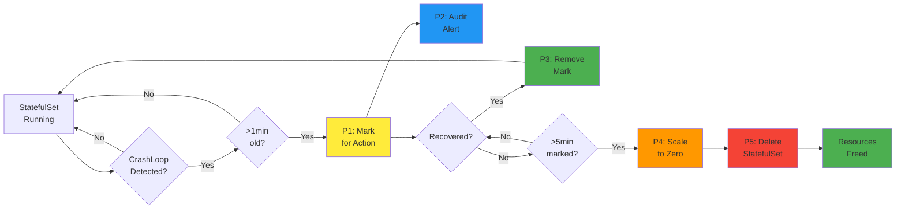

# Automated StatefulSet Cleanup with Kyverno - Resource Optimizer

## 🔄 System Workflow Diagram



## Overview

This folder contains a comprehensive Kyverno policy set designed to automatically detect, monitor, and clean up problematic StatefulSets in Kubernetes clusters. The system focuses on identifying StatefulSets with persistent CrashLoopBackOff issues and progressively scaling them down to optimize cluster resources.

**Key Differences from Deployment Cleanup:**
- Targets StatefulSets instead of Deployments
- Uses unique context variables (prefixed with `sts`) to avoid conflicts
- Uses StatefulSet-specific annotations (`sts-cleanup.resource`, `sts-timestamp`, `sts-scaledowntimestamp`)
- Directly monitors StatefulSet ownership without ReplicaSet intermediary

## 🎯 Objectives

- **Resource Optimization**: Automatically identify and remove resource-consuming failed StatefulSets
- **Proactive Monitoring**: Early detection of problematic StatefulSets before they impact cluster performance
- **Progressive Cleanup**: Multi-stage approach with recovery opportunities and audit trails
- **Cost Reduction**: Free up computational resources from persistently failing workloads
- **StatefulSet-Specific**: Handle stateful workloads with appropriate care for data persistence

## 🔄 Workflow Overview

The cleanup process follows a 5-stage progressive approach:

1. **Detection & Marking** → Mark StatefulSets with persistent issues
2. **Audit & Notification** → Alert teams about pending actions
3. **Recovery Handling** → Remove marks if issues resolve
4. **Scale Down** → Reduce resource consumption
5. **Final Cleanup** → Remove unsuccessful StatefulSets

## 📋 Policy Details

### 1. CrashLoopBack Detection & Mutation
**File**: `1-clusterpolicy-statefulset-crashloopback-mutation.yaml`

**Purpose**: Identifies and marks problematic StatefulSets
- Monitors StatefulSets where all pods are in CrashLoopBackOff state
- Checks if the last update timestamp of the StatefulSet is > 1 minute old
- Adds identification annotations for tracking. Here `{{ time_now_utc() }}` refers to the time in UTC timezone

**Annotations Added**:
```yaml
sts-cleanup.resource: "marked-for-action"
sts-timestamp: "{{ time_now_utc() }}"
```

**Unique Context Variables**:
- `stsOwnerName` - StatefulSet owner name
- `statefulsetname` - StatefulSet name
- `desiredSTSReplicas` - Desired replica count
- `stsMatchLabels` - StatefulSet match labels
- `stsLabelSelector` - Label selector for pods
- `stsCrashedReplicas` - Count of crashed replicas
- `stsRunningReplicas` - Count of running replicas
- `stsCrashedInitContainersReplicas` - Count of crashed init containers
- `stsLastUpdateTimestamp` - Last update timestamp

### 2. Audit & Validation Policy
**File**: `2-clusterpolicy-statefulset-crashloopback-validation.yaml`

**Purpose**: Provides visibility and alerts for marked StatefulSets
- Audit-mode policy that flags StatefulSets marked for action
- Generates policy reports for monitoring dashboards (Nirmata Control Hub (NCH) or Grafana)
- Notifies users about pending scale-down actions

### 3. Recovery & Label Removal
**File**: `3-clusterpolicy-statefulset-crashloopback-remove-label-mutation.yaml`

**Purpose**: Handles StatefulSet recovery scenarios
- Monitors StatefulSets with running pods > 0
- Automatically removes cleanup annotations when issues resolve
- Prevents unnecessary actions on recovered StatefulSets

**Annotations Removed**:
```yaml
sts-cleanup.resource: "marked-for-action"
sts-timestamp: "<previous_timestamp>"
```

**Unique Context Variables (V2)**:
- `stsOwnerNameV2` - StatefulSet owner name (version 2)
- `statefulsetnameV2` - StatefulSet name (version 2)
- `desiredSTSReplicasV2` - Desired replica count (version 2)
- `stsMatchLabelsV2` - StatefulSet match labels (version 2)
- `stsLabelSelectorV2` - Label selector for pods (version 2)
- `stsCrashedReplicasV2` - Count of crashed replicas (version 2)
- `stsRunningReplicasV2` - Count of running replicas (version 2)
- `stsCrashedInitContainersReplicasV2` - Count of crashed init containers (version 2)
- `stsLastUpdateTimestampV2` - Last update timestamp (version 2)

### 4. Scale Down Mutation
**File**: `4-clusterpolicy-statefulset-scaledown-mutation.yaml`

**Purpose**: Scales down persistently problematic StatefulSets
- Targets StatefulSets marked for action for > 5 minutes
- Scales replicas to 0 to stop resource consumption
- Adds scale-down timestamp for final cleanup tracking

**Actions**:
- Set `spec.replicas: 0`
- Add `sts-scaledowntimestamp: "{{ time_now_utc() }}"`

### 5. StatefulSet Deletion
**File**: `5-clusterpolicy-delete-statefulset.yaml`

**Purpose**: Final cleanup of scaled-down StatefulSets
- Identifies StatefulSets with scale-down timestamps
- Completely removes StatefulSets from the cluster
- Frees up all associated resources

**⚠️ Important Note**: Deleting StatefulSets will also remove associated PersistentVolumeClaims and data. Ensure proper backup procedures are in place.

## 🚀 Benefits

### Resource Optimization
- **Immediate Impact**: Stop resource consumption from failing pods
- **Cost Savings**: Reduce compute costs from unnecessary replicas
- **Cluster Health**: Prevent resource exhaustion from accumulating failed StatefulSets

### Operational Excellence
- **Automated Recovery**: Self-healing system that recovers when issues resolve
- **Audit Trail**: Complete visibility into cleanup actions
- **Progressive Approach**: Multiple checkpoints prevent accidental deletions

### Developer Experience
- **Early Warning**: Audit policies provide advance notice
- **Recovery Window**: 5-minute grace period allows for quick fixes
- **Transparency**: Clear annotation system shows system state

## 🛠️ Installation

1. **Prerequisites**:
   - Kyverno v1.10+ installed in your cluster
   - Appropriate RBAC permissions for Kyverno to modify StatefulSets
   - Kyverno's ConfigMap modified to remove the line `excludeGroups: system:nodes`. This is needed from v1.10 onwards
   - Kyverno's ConfigMap modified to generate events for all policy types (Update `generateSuccessEvents: "true"`)

2. **Deploy Policies**:
   ```bash
   kubectl apply -f 1-clusterpolicy-statefulset-crashloopback-mutation.yaml
   kubectl apply -f 2-clusterpolicy-statefulset-crashloopback-validation.yaml
   kubectl apply -f 3-clusterpolicy-statefulset-crashloopback-remove-label-mutation.yaml
   kubectl apply -f 4-clusterpolicy-statefulset-scaledown-mutation.yaml
   kubectl apply -f 5-clusterpolicy-delete-statefulset.yaml
   ```

3. **Verify Installation**:
   ```bash
   kubectl get clusterpolicy
   kubectl get policyreport -A
   ```

## 🔍 Monitoring

### Policy Reports
Monitor cleanup activities through Kyverno policy reports:
```bash
kubectl get policyreport -A | grep statefulset
```

### StatefulSet Annotations
Check StatefulSet status via annotations:
```bash
kubectl get statefulsets -A -o jsonpath='{range .items[*]}{.metadata.name}{"\t"}{.metadata.annotations.sts-cleanup\.resource}{"\n"}{end}'
```

### Cluster Events
Monitor Kubernetes events for policy actions:
```bash
kubectl get events --field-selector reason=PolicyViolation
```

## ⚠️ Important Considerations

### StatefulSet-Specific Warnings
- **Data Loss Risk**: Deleting StatefulSets may result in permanent data loss
- **PVC Management**: Consider PVC retention policies before implementing
- **Backup Strategy**: Ensure proper backup procedures for stateful data
- **Recovery Time**: StatefulSets may take longer to recover than Deployments

### Safety Measures
- **Grace Period**: 5-minute window allows for issue resolution
- **Recovery Logic**: Automatic removal of marks when StatefulSets recover
- **Audit Trail**: All actions are logged and visible
- **Namespace Exclusions**: kube-system namespace is excluded by default

### Customization Options
- Adjust timing thresholds in policy conditions
- Modify annotation keys/values for your organization
- Add namespace exclusions for critical systems
- Configure notification integrations
- Customize PVC handling behavior

### Best Practices
- **Test First**: Test policies in development environments
- **Monitor Regularly**: Monitor policy reports regularly
- **Set Up Alerts**: Set up alerting on policy violations
- **Document Procedures**: Document StatefulSet recovery procedures
- **Backup Strategy**: Implement comprehensive backup strategies
- **Gradual Rollout**: Roll out policies gradually across environments

## 🔗 Conflict Prevention

This policy set uses unique context variables and annotations to prevent conflicts with the Deployment cleanup policies:

### Unique Context Variables:
- All variables prefixed with `sts` (e.g., `stsOwnerName`, `stsMatchLabels`)
- Version 2 variables suffixed with `V2` (e.g., `stsOwnerNameV2`)

### Unique Annotations:
- `sts-cleanup.resource` instead of `cleanup.resource`
- `sts-timestamp` instead of `timestamp`
- `sts-scaledowntimestamp` instead of `scaledowntimestamp`

### Unique Policy Names:
- All policies prefixed with `statefulset` or contain `statefulset` in the name

## 📚 Additional Resources

- [Kyverno Documentation](https://kyverno.io/docs/)
- [Kyverno Policy Library](https://kyverno.io/policies/)
- [Kubernetes StatefulSet Documentation](https://kubernetes.io/docs/concepts/workloads/controllers/statefulset/)
- [StatefulSet Backup Best Practices](https://kubernetes.io/docs/tasks/run-application/run-replicated-stateful-application/)

---

**Note**: This system is designed for production environments where automated cleanup is desired. Given the stateful nature of these workloads and potential for data loss, ensure proper testing, backup procedures, and stakeholder approval before implementing in critical systems. 